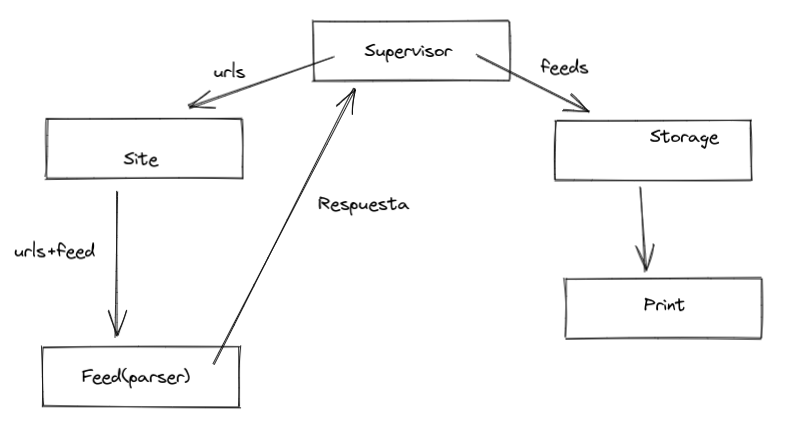
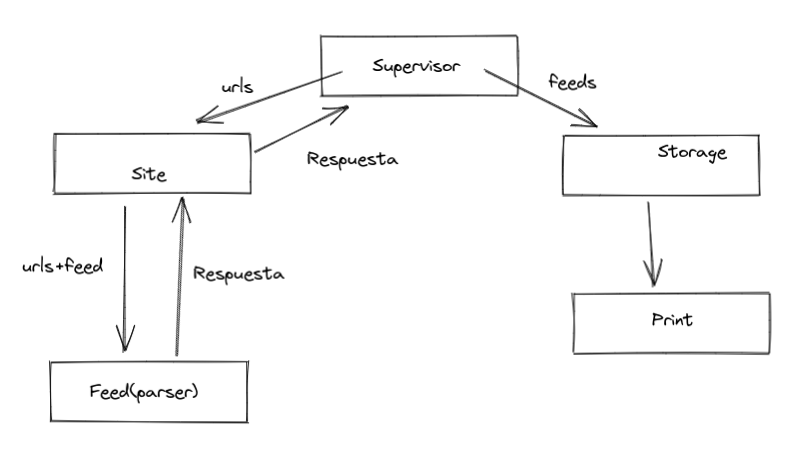

# Laboratorio 3: Programación Concurrente Usando Actores en Scala

## Primera parte: Diseñando la arquitectura

La arquitectura que definimos tiene como actor principal a un supervisor que se encarga de leer el archivo de suscripciones y luego una vez que obtuvo el contenido de los *feeds* lo manda a *storage* para que se guarde en el disco.

Por otra parte, *Site* se encarga de hacer el pedido HTTP a un URL, *feed* parsea el contenido de esa respuesta y luego se la envía al supervisor.

Para la parte 3, cambiamos la estructura de forma que nos permita implementar un *request-responde*. Entonces el resultado de *Feed* se retorna a *Site* y luego se pasa al supervisor, donde este último lo guarda en disco con *storage* como se puede observar en la siguiente imagen.

